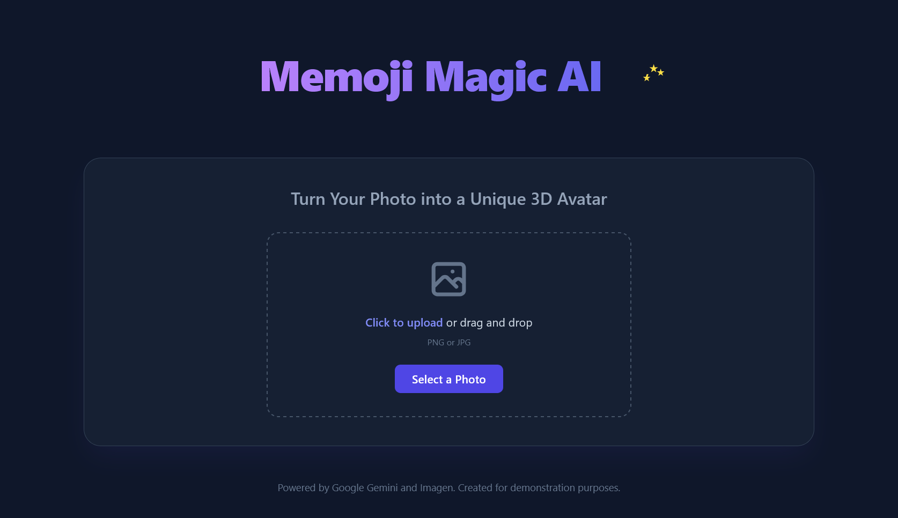
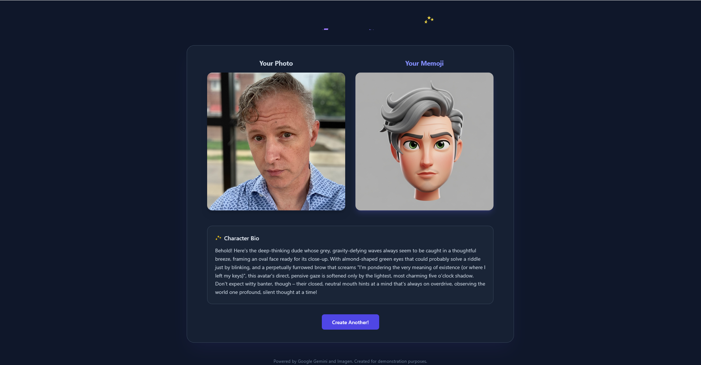
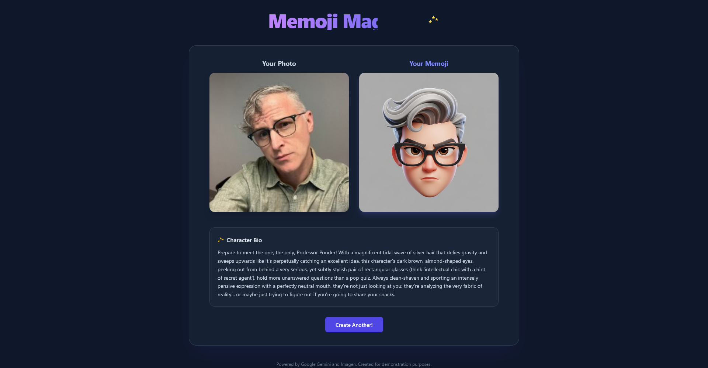
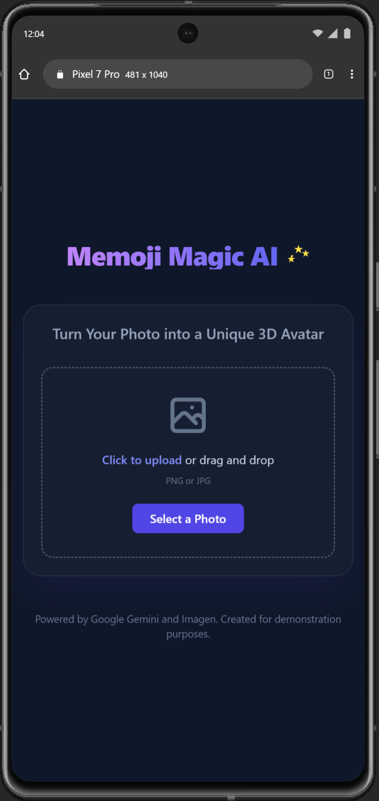
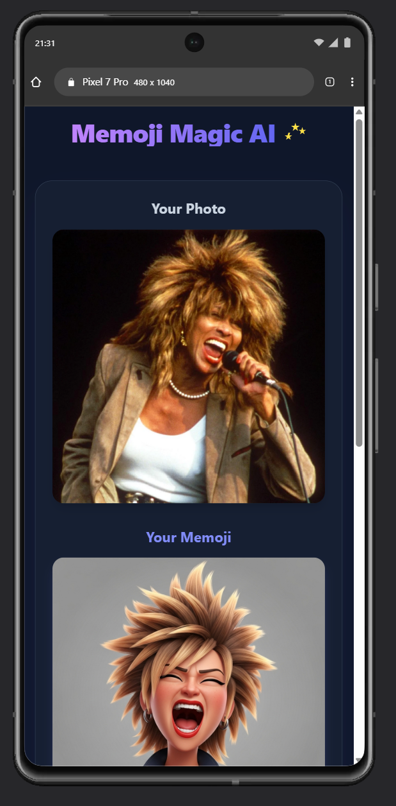

<div align="center">

</div>

# Memoji Magic AI -  A memoji generating app created by a Google AI prompt
This project was created as part of the [DEV community](https://dev.to/enter)'s "[**Build Apps with Google AI Studio**](https://dev.to/deved/build-apps-with-google-ai-studio?bb=238782)" [Education Tracks](https://dev.to/devteam/introducing-dev-education-tracks-expert-guided-tutorials-for-learning-new-skills-and-earning-badges-48oi)

## Description
Upload a photo of yourself and watch as AI magically transforms it into a personalized 3D memoji avatar with a unique character bio.

## Assignment Instructions:
Use the Build feature in Google AI Studio to build an app that incorporates image generation with the Imagen API.

[Link to assignment instruction on DEV](https://dev.to/deved/build-apps-with-google-ai-studio?bb=238782)

## Project Inspiration
I'm new to Web Development with novice level coding knowledge; and even less knowledge about AI. This project seemed like a great introductory-level lesson for programming with AI and I'd like to thank the people at [DEV](https://dev.to/enter) and [Google AI](https://dev.to/googleai) for offering it.

As for the app concept, I thought it would be fun to build an app that was able to create a Memoji based on a photograph of your choosing.

## Initiating Build Prompt
Here is the exact prompt I entered to initiate the creation the project:

> "Please create an app using React, Typescript, and Tailwind CSS that generates a memoji based on a JPG or PNG picture submitted by the user. Please use Imagen for the visuals, and Gemini to create any text descriptions or instructions needed .You can use the attached JPG as a sample"
(I submitted my LinkedIn profile picture as the test sample.)

### Full Disclosure of Source Code
Other than the initating prompt listed above, and a few minor CSS corrections, all of the code for this app was generated by Google AI Studio's Build Feature.

## Prerequisites:
* Node.js (v.18 minimally) v.25.9 was used for this project
* Google Gemini API Key - free Google Gemini API Key available at https://aistudio.google.com/apikey

## Tech Stack  / Dependencies
* Google/Gemini v.1.15.0
* React v.19.1.1
* Typescript v.5.8.2
* Tailwind CSS v.4.1
* Vite 6.2.0

## Install and Run App Locally

1. Clone this repo:
```
git clone https://github.com/notavailable4u/memoji-magic-ai.git

```
2. Install dependencies
```
npm install

```
3. Create an `.env.local` file in the main directory.

4. Set the `GEMINI_API_KEY` in .`env.local` to your Gemini API key.
```
GEMINI_API_KEY = YOUR_GEMINI_API_KEY

```

5. Run the app:
```
npm run dev

```

## Screenshots

App Main page: Desktop view


Sample 1 Result page: Desktop view


Text of Sample 1 Bio generated by AI app reads:
> Behold! Here's the deep-thinking dude whose grey, gravity-defying waves always seem to be caught in a thoughtful breeze, framing an oval face ready for its close-up. With almond-shaped green eyes that could probably solve a riddle just by blinking, and a perpetually furrowed brow that screams "I'm pondering the very meaning of existence (or where I left my keys)", this avatar's direct, pensive gaze is softened only by the lightest, most charming five o'clock shadow.
> Don't expect witty banter, though – their closed, neutral mouth hints at a mind that's always on overdrive, observing the world one profound, silent thought at a time!

Sample 2 Result page: Desktop view


Text of Sample 2 Bio generated by AI app reads:
> Prepare to meet the one, the only, Professor Ponder! With a magnificent tidal wave of silver hair that defies gravity and sweeps upwards like it's perpetually catching an excellent idea, this character's dark brown, almond-shaped eyes, peeking out from behind a very serious, yet subtly stylish pair of rectangular glasses (think ‘intellectual chic with a hint of secret agent’), hold more unanswered questions than a pop quiz. Always clean-shaven and sporting an intensely pensive expression with a perfectly neutral mouth, they're not just looking at you; they're analyzing the very fabric of reality… or maybe just trying to figure out if you're going to share your snacks.

App Main page: Mobile view (Pixel 7 Pro)


Sample 3 Result page: Mobile view


## Features
This app is still a work in progress.

* The app only works with an image of a person.
  * I submitted a picture of my cat, Flash, and it generated a memoji and bio text for a person. Flash was deeply offended.
  * The capabilty to submit human or animal photos, or a error message should be thrown to alert the user to only use photos of humans.
* The app works best when the submitted photo is a square, 1:1 ratio, one-quater style photo.
  * When I submitted a full body shot, it focused on the face and successfully created a memoji, but on the Result page, the original photo is cropped to torso only.
* Currently, you have to download the memoji and Bio Text as two seperate files. I would prefer the option to download the original photo, the memoji, and Bio Text as one image - as it appears in the Result page.

All of these features could easily be added / corrected using the Build Prompt, but at this point I would like to focus on learning to build with the Gemini Developer API.


